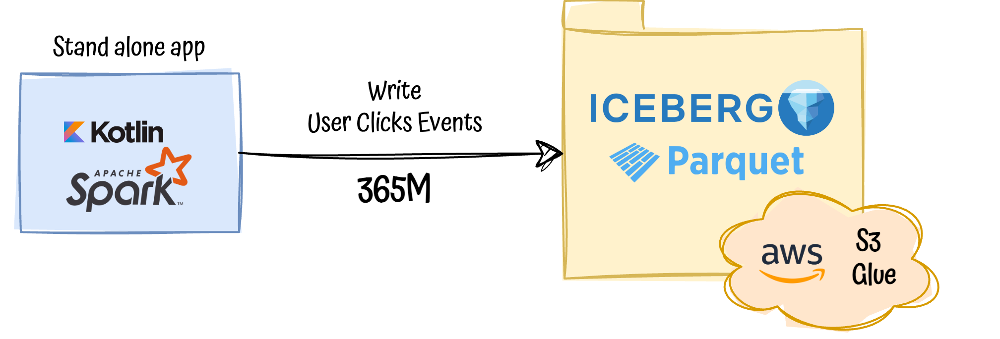
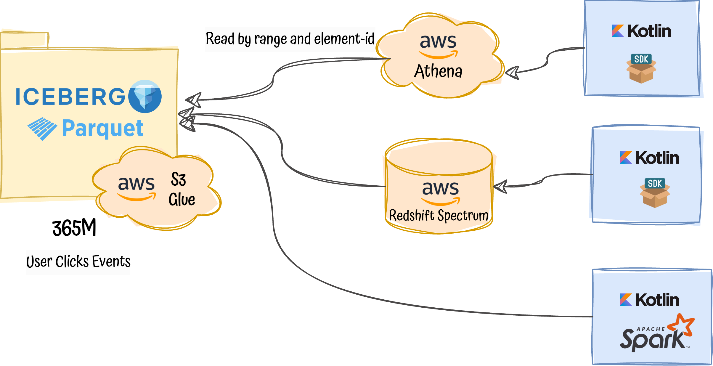

# Lake-house with apache Iceberg and AWS

## Description

This project explores and assess apache **Iceberg** as a backbone to implement a **lake-house approach** to store and access  
huge amounts of raw data produced in an imaginary tech company.

As a business driving use-case the project will try to full-fill the following **usecase**:
- We need to store **6 millions of user clicks per day**, of course, it needs to scale, we are ambitious.
- We have two **access patterns** to this information:
  - **By day**, some ML apps will access to generate their predictions and detect patterns.
  - **By date range given an element-id**, BI would like to create some real-time BI dashboards around it, we are not expecting super performant reads, but we wouldn't like to have our analyst **waiting for minutes** to see the data.

As a non-functional requirements:
- As cheap as possible, less money the better.
- Scalable, we will have trillions of data to store in the near future ;-p 
- Abstract, we would like to apply this solution to potentially store all our raw data generated by streaming platforms (such kafka), FE events, ETLs ...

### Project scope

In order to assess iceberg the project is divided in two parts: 

#### Writing side

365 Millions of user clicks are going to be inserted in S3 with Iceberg table format using a stand-alone application, here 
we will check how easy is to do so, how to deal with partitioning, AWS integrations and so on.



The writing part is not covering different ingestion mechanisms such as getting streaming events, CDC tools or an ETL pipelines, 
we work with the assumption that there data is already there ready to be stored.

#### Reading side

The project is going to read the data stored in S3 in three different ways:



## Prerequisites

The project will mainly integrate with AWS services, infra-code for these integrations is not provided within the project,
hence you will need:

- Provide AWS [credentials](https://docs.aws.amazon.com/cli/latest/userguide/cli-chap-configure.html)
- A glue catalog with a predefined database is also expected, just [create a DB](https://docs.aws.amazon.com/glue/latest/dg/start-data-catalog.html), nothing else.
- Redshift spectrum cluster linked to our glue catalog. Please follow these [steps.](https://docs.aws.amazon.com/redshift/latest/dg/querying-iceberg.html)

## Outcome/Benchmark

S3 partition strategy: days(time), bucket(128, element_id) 

```shell
/data/time_day=2023-09-14/element_id_bucket=90/00002-10-e6831803-7cb4-4a2a-ad3f-ee3f1bc4f730-00001.parquet
```
### S3
| **Metric**                  | **Value**  | **Comments**                                         |  
|-------------------------|--------|--------------------------------------------------|
| Objects                 | ~80000 |                                                  |
| Daily parquet file size | ~650Kb | Maybe not the best size (Small size problem)     |
| Bucket total size       | ~32 GB | 100Mb Metadata + (85MB*128 buckets) *day of data |
| #S3 requests            | ~80000 |                                                  |
|  Cost                       |  ~1.2 $      |     ~0.5$ (~80000 puts $0.0054 * 1000) + 0.784$ (32 * $0.0245 per GB) https://aws.amazon.com/s3/pricing/                                             | 

### Fetching data

Fetch all user clicks given a element-id within a date range:

| Fetch tool                     | Latency (2 months) | Data scanned (2 months) | Latency (1 year)  | Data scanned (1 year) | Comments                                  |
|--------------------------------|--------------------|----------------------|---|-----------------------|-------------------------------------------|
| Athena (sdk client)            | ~5/6s              | 18 MB                | ~5/6s  | 68 MB                 |                                           |
| Spark (client)                 | 20-40 sec          | 139 MB               |  20-40 sec | 223 MB                |                                           |
| Plain iceberg libs             | 30-40 sec          | 150MB                |  20-40 sec | 250 MB                |                                           |
| Redshift Spectrum (sdk client) | ~5/6s              |                      | ~7/8s  |                       |  redshift serverless with defaults |


#### Trade-off analysis


| **Fetch tool**     | **Pros**                                                                                              | **Cons**                                                                                                                          |       
|--------------------|-------------------------------------------------------------------------------------------------------|-----------------------------------------------------------------------------------------------------------------------------------|
| Athena             | - Latency (sec) <br/> - Serverless service <br/> - Iceberg seamless integration <br/> - SQL interface | - Potential bottleneck since it is a shared resource ([quotas](https://docs.aws.amazon.com/athena/latest/ug/service-limits.html)) | 
| Spark              | - Direct connection to S3 buckets (no middlewares to manage) <br/> - Iceberg seamless integration <br/> - SQL interface                   | - Latency (min) <br/>                                                                                                             |
| Iceberg plain libs | - Direct connection to S3 buckets (no middlewares to manage) <br/>                 | - Latency (min) <br/> - Ingestion is slow - No SQL                                                                                |
| Redshift Spectrum  | - Latency (sec) <br/> - Iceberg seamless integration <br/> - SQL interface                                                                | - Requires cluster management and cfg <br/> - Extra [cost](https://aws.amazon.com/redshift/pricing/)                              |


## Next Steps

TODO